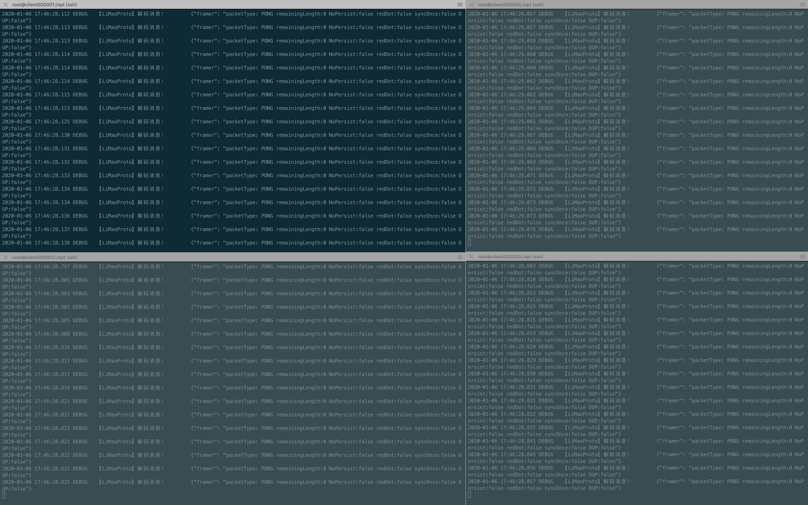

## 狸猫IM同时在线人数测试

#### 环境

1台服务器

server CentOS Linux release 7.7.1908 (Core) 8 vCPU 8 GiB 101.133.162.86(172.19.149.0)

5台压测机

client000001  CentOS Linux release 7.7.1908 (Core) 2 vCPU 4 GiB 101.133.172.189(172.19.148.251)

client000002  CentOS Linux release 7.7.1908 (Core) 2 vCPU 4 GiB 101.133.168.183(172.19.148.252)
 
client000003  CentOS Linux release 7.7.1908 (Core) 2 vCPU 4 GiB 101.133.170.62(172.19.148.253)

client000004  CentOS Linux release 7.7.1908 (Core) 2 vCPU 4 GiB 101.133.169.122(172.19.148.254)

client000005  CentOS Linux release 7.7.1908 (Core) 2 vCPU 4 GiB 101.133.168.154(172.19.148.255)


 ## server端执行如下命名


### server端


```
yum install docker -y
yum install docker-compose -y
systemctl start docker
mkdir -p /opt/data
chmod -R 777 /opt/data
```
/opt下 新建文件docker-compose.yml 内容如下

 ```
version: '3.1'

services:
  redis:
    image: redis
    restart: always
    volumes:
      - ./redis:/data
  redis-commander:
    image: rediscommander/redis-commander:latest
    restart: always
    environment:
      - REDIS_HOSTS=local:redis:6379
    ports:
      - "8088:8081"
  limaoim:
      image: tangtaoit/limaoim:latest
      ports:
        - 6666:6666
        - 8029:8029
      environment:
        - TEST=true
      restart: always
      volumes:
        - ./data:/home/data

 ```
 
 启动狸猫IM
 
 ```
 docker-compose up -d
 ```
 
 服务器调优
 
 ```
echo 2000500 > /proc/sys/fs/nr_open
ulimit -n 2000500
 ```
 
###  压测机器

压测机调优

```
sysctl -w fs.file-max=2000500
sysctl -w fs.nr_open=2000500
sysctl -w net.nf_conntrack_max=2000500
ulimit -n 2000500

echo "net.ipv4.tcp_mem = 786432 2097152 3145728">> /etc/sysctl.conf
echo "net.ipv4.tcp_rmem = 4096 4096 16777216">> /etc/sysctl.conf
echo "net.ipv4.tcp_wmem = 4096 4096 16777216">> /etc/sysctl.conf

vi /etc/sysctl.conf

net.ipv4.ip_forward=1
net.ipv4.tcp_tw_reuse = 1
net.ipv4.tcp_tw_recycle = 1
net.ipv4.tcp_mem = 786432 2097152 3145728
net.ipv4.tcp_rmem = 4096 4096 16777216
net.ipv4.tcp_wmem = 4096 4096 16777216
net.ipv4.tcp_timestamps=1    

## 立即生效
/sbin/sysctl -p


```

 拷贝 bench_connection 到各压测服务内
 
 ```
 scp bench_connection root@101.133.172.189:/opt
 scp bench_connection root@101.133.168.183:/opt
 scp bench_connection root@101.133.170.62:/opt
 scp bench_connection root@101.133.169.122:/opt
 scp bench_connection root@101.133.168.154:/opt
 ```
 
 bench_connection的使用方法如下
 
 ```
 ./bench_connection -h
  -cids string
        客户端ID区间 默认: 1-1000 (default "1-1000")
  -hostname string
        狸猫IM IP地址 默认:127.0.0.1 (default "127.0.0.1")
  -timeout duration
        运行超时时间，默认: 10分钟 (default 10m0s)
 ```
 
在client000001机器上上线2.5万个客户端 客户端ID范围 1-25000

```
./bench_connection -cids 1-25000 -hostname=172.19.149.0
```

在client000002机器上上线2.5万个客户端 客户端ID范围 25001-50000

```
./bench_connection -cids 25001-50000 -hostname=172.19.149.0
```

在client000003机器上上线4万个客户端 客户端ID范围 50001-75000

```
./bench_connection -cids 50001-75000 -hostname=172.19.149.0
```

在client000004机器上上线4万个客户端 客户端ID范围 75001-100000

```
./bench_connection -cids 75001-100000 -hostname=172.19.149.0
```

在client000005机器上上线4万个客户端 客户端ID范围 100001-125000

```
./bench_connection -cids 100001-125000 -hostname=172.19.149.0
```

### server端数指标观察

客户端日志



top指标


socket


网络


狸猫自带监控(待完善版)

client_online_count为客户端在线数量

items里为每个客户的收发消息情况


总结：

10万同时在线1小时的指标 内存占用4.1G 8核CPU机器 CPU使用率为：18.8% (内存消耗还有优化空间)

发送流量TX高峰为 6.8M，接收流量 高峰为3.79M （狸猫IM采用自定义协议每个消息包极小，心跳包只有1byte 所以10万在线流量也是极低）


